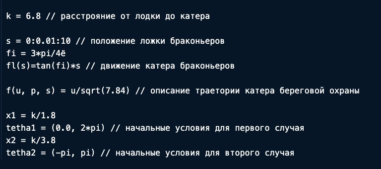
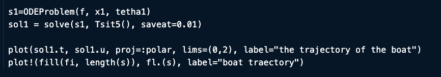
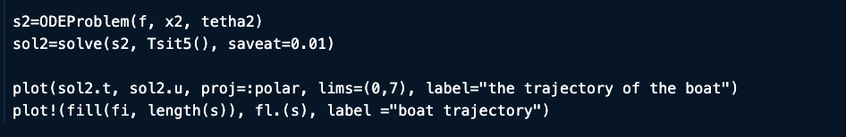
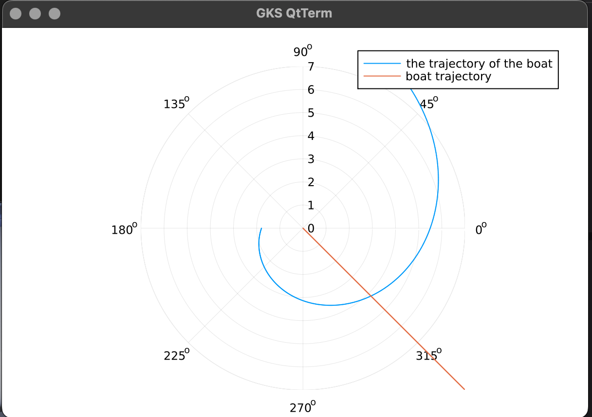

---
## Front matter
lang: ru-RU
title: Лабораторная работа №2
subtitle: Математическое моделирование
author:
  - Дикач А.О.
institute:
  - Российский университет дружбы народов, Москва, Россия
date: 28 февраля 2025

## i18n babel
babel-lang: russian
babel-otherlangs: english

## Formatting pdf
toc: false
toc-title: Содержание
slide_level: 2
aspectratio: 169
section-titles: true
theme: metropolis
header-includes:
 - \metroset{progressbar=frametitle,sectionpage=progressbar,numbering=fraction}
---

# Информация

## Докладчик

  * Дикач Анна Олеговна
  * НПИбд-01-22 (1132222009)
  * Российский университет дружбы народов
  * <https://github.com/chelibos?tab=repositories>

## Цель работы

1. Провести аналогичные рассуждения и вывод дифференциальных уравнений,
если скорость катера больше скорости лодки в n раз (значение n задайте
самостоятельно)
2. Построить траекторию движения катера и лодки для двух случаев. (Задайте
самостоятельно начальные значения)
Определить по графику точку пересечения катера и лодки.

# Выполнение лабораторной работы

## Задача

На море в тумане катер береговой охраны преследует лодку браконьеров.
Через определенный промежуток времени туман рассеивается, и лодка
обнаруживается на расстоянии 6,8 км от катера. Затем лодка снова скрывается в
тумане и уходит прямолинейно в неизвестном направлении. Известно, что скорость
катера в 2,8 раза больше скорости браконьерской лодки.
- Запишите уравнение, описывающее движение катера, с начальными
условиями для двух случаев (в зависимости от расположения катера
относительно лодки в начальный момент времени).
- Постройте траекторию движения катера и лодки для двух случаев.
- Найдите точку пересечения траектории катера и лодки

## Построение математической модели. Задаём начальные условия

{#fig:003 width=50%}

## Строим решение для первого случая

{#fig:004 width=50%}

## Математическая модель

{#fig:001 width=50%}

## Строю решение для второго случая 

{#fig:005 width=50%}

## Математическая модель

{#fig:002 width=50%}

## Вывод

Провела серию рассуждений, вывела дифференциальные уравнения, построила траекторию движения катера и лодки для 2-х случаев.
