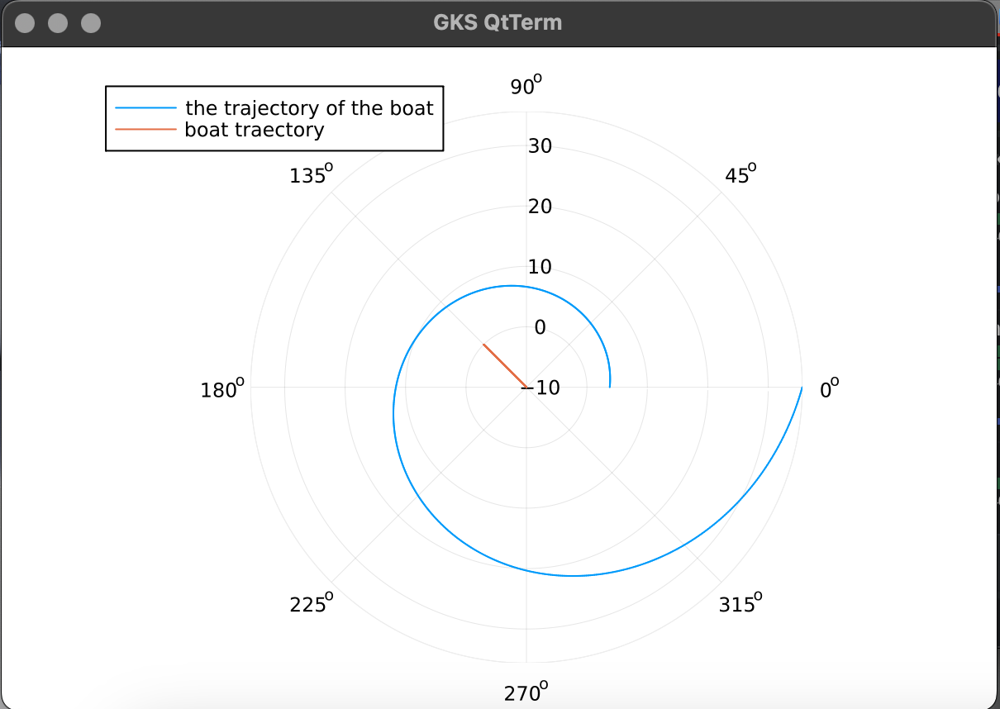

---
## Front matter
title: "Лабораторная работа №2"
subtitle: "Математическое моделирование"
author: "Дикач Анна Олеговна НПИбд-01-22"

## Generic otions
lang: ru-RU
toc-title: "Содержание"

## Bibliography
bibliography: bib/cite.bib
csl: pandoc/csl/gost-r-7-0-5-2008-numeric.csl

## Pdf output format
toc: true # Table of contents
toc-depth: 2
lof: true # List of figures
lot: true # List of tables
fontsize: 12pt
linestretch: 1.5
papersize: a4
documentclass: scrreprt
## I18n polyglossia
polyglossia-lang:
  name: russian
  options:
  - spelling=modern
  - babelshorthands=true
polyglossia-otherlangs:
  name: english
## I18n babel
babel-lang: russian
babel-otherlangs: english
## Fonts
mainfont: IBM Plex Serif
romanfont: IBM Plex Serif
sansfont: IBM Plex Sans
monofont: IBM Plex Mono
mathfont: STIX Two Math
mainfontoptions: Ligatures=Common,Ligatures=TeX,Scale=0.94
romanfontoptions: Ligatures=Common,Ligatures=TeX,Scale=0.94
sansfontoptions: Ligatures=Common,Ligatures=TeX,Scale=MatchLowercase,Scale=0.94
monofontoptions: Scale=MatchLowercase,Scale=0.94,FakeStretch=0.9
mathfontoptions:
## Biblatex
biblatex: true
biblio-style: "gost-numeric"
biblatexoptions:
  - parentracker=true
  - backend=biber
  - hyperref=auto
  - language=auto
  - autolang=other*
  - citestyle=gost-numeric
## Pandoc-crossref LaTeX customization
figureTitle: "Рис."
tableTitle: "Таблица"
listingTitle: "Листинг"
lofTitle: "Список иллюстраций"
lotTitle: "Список таблиц"
lolTitle: "Листинги"
## Misc options
indent: true
header-includes:
  - \usepackage{indentfirst}
  - \usepackage{float} # keep figures where there are in the text
  - \floatplacement{figure}{H} # keep figures where there are in the text
---

# Цель работы

1. Провести аналогичные рассуждения и вывод дифференциальных уравнений,
если скорость катера больше скорости лодки в n раз (значение n задайте
самостоятельно)
2. Построить траекторию движения катера и лодки для двух случаев. (Задайте
самостоятельно начальные значения)
Определить по графику точку пересечения катера и лодки.

# Выполнение лабораторной работы

1. **Задача вариант 10**

На море в тумане катер береговой охраны преследует лодку браконьеров.
Через определенный промежуток времени туман рассеивается, и лодка
обнаруживается на расстоянии 6,8 км от катера. Затем лодка снова скрывается в
тумане и уходит прямолинейно в неизвестном направлении. Известно, что скорость
катера в 2,8 раза больше скорости браконьерской лодки.
- Запишите уравнение, описывающее движение катера, с начальными
условиями для двух случаев (в зависимости от расположения катера
относительно лодки в начальный момент времени).
- Постройте траекторию движения катера и лодки для двух случаев.
- Найдите точку пересечения траектории катера и лодки

2. Для начала запишем уравнение, которое описывает движение катера, задаём начальные точки. 
s = 0 и x = 0 место нахождения браконьеров, $x_{k0}=k$ место нахождения лодки охраны.

3. Для вычислений будем использовать полярные координаты, где полюс - место обнаружения браконьеров $x_{k0}$ ($\theta = x_{k0} = 0$). Полярная ось направлена через начальное положение катера береговой охраны.

4. Траектория катера должна быть построена так, чтобы катер и лодка всегда находились на одинаковом расстоянии от полюса $\theta$. Только в этом случае их траектории пересекутся. Для этого катер сначала движется прямолинейно до тех пор, пока не окажется на том же расстоянии от полюса, что и лодка. Затем катер начинает двигаться по окружности, удаляясь от полюса с той же скоростью, что и лодка.

5. Чтобы определить расстояние $x$ (точку, после которой катер начнет движение по окружности), составим уравнение. Пусть через время катер и лодка окажутся на одинаковом расстоянии $x$ от полюса. За это время лодка пройдет расстояние $x$, а катер — $k - x$ (или $k + x$, в зависимости от начального положения катера относительно полюса). Время, за которое они пройдут эти расстояния, вычисляется как $\dfrac{x}{v}$ или $\dfrac{k - x}{2.8v} $ во втором случае $\dfrac{k + x}{2.8v}$. Поскольку время одинаково, получаем уравнения:

$$
\dfrac{x}{v} = \dfrac{k - x}{2.8v} \quad \text{(первый случай)}
$$
$$
\dfrac{x}{v} = \dfrac{k + x}{2.8v} \quad \text{(второй случай)}
$$

Из этих уравнений находим два значения $ x_1 = \dfrac{6.8}{1.8} $ и $ x_2 = \dfrac{6.8}{3.8}$. Далее задача решается для обоих случаев.

6. Когда катер окажется на том же расстоянии от полюса, что и лодка, он переходит от прямолинейного движения к движению по окружности, удаляясь от полюса со скоростью лодки $v$. Для этого скорость катера раскладывается на две составляющие: $ v_{r}$ — радиальная скорость и $v_{\tau} $ — тангенциальная скорость. Радиальная скорость — это скорость удаления катера от полюса, $v_r = \dfrac{dr}{dt} $. Чтобы она совпадала со скоростью лодки, полагаем $\dfrac{dr}{dt} = v $.

Тангенциальная скорость — это линейная скорость вращения катера вокруг полюса. Она равна произведению угловой скорости $ \dfrac{d \theta}{dt} $ на радиус r , то есть $r \dfrac{d \theta}{dt} $. Получаем:

$$
v_{\tau} = \sqrt{7.84v^2 - v^2} = \sqrt{6.84}v
$$

Отсюда следует:
$$
r\dfrac{d \theta}{dt} = \sqrt{6.84}v
$$

7. Решение задачи сводится к системе дифференциальных уравнений:

$$
\begin{cases}
&\dfrac{dr}{dt} = v\\
&r\dfrac{d \theta}{dt} = \sqrt{6.84}v
\end{cases}
$$

С начальными условиями для первого случая:

$$
\begin{cases}
&{\theta}_0 = 0 \quad \text{(1)}\\
&r_0 = \dfrac{6.8}{1.8}
\end{cases}
$$

И для второго случая:
$$
\begin{cases}
&{\theta}_0 = -\pi \quad \text{(2)}\\
&r_0 = \dfrac{6.8}{3.8}
\end{cases}
$$

Исключив из системы производную по  s, переходим к уравнению:

$$
\dfrac{dr}{d \theta} = \dfrac{r}{\sqrt{6.84}}
$$

Начальные условия остаются неизменными. Решив это уравнение, получим траекторию движения катера в полярных координатах.ё

8. Переходим к построению математической модели Начинаем с начальных условий

 k = 6.8 // расстрояние от лодки до катера

 s = 0:0.01:10 // положение ложки браконьеров
 fi = 3*pi/4ё
 fl(s)=tan(fi)*s // движение катера браконьеров

 f(u, p, s) = u/sqrt(7.84) // описание траетории катера береговой охраны

 x1 = k/1.8 
 tetha1 = (0.0, 2*pi) // начальные условия для первого случая
 x2 = k/3.8 
 tetha2 = (-pi, pi) // начальные условия для второго случая

9. Строю решение для первого случая (рис. [-@fig:001])

 s1=ODEProblem(f, x1, tetha1)
 sol1 = solve(s1, Tsit5(), saveat=0.01)
 
 plot(sol1.t, sol1.u, proj=:polar, lims=(0,2), label="the trajectory of the boat")
 plot!(fill(fi, length(s)), fl.(s), label="boat traectory")

{#fig:001 width=50%}

10. Строю решение для второго случая (рис. [-@fig:002])

 s2=ODEProblem(f, x2, tetha2)
 sol2=solve(s2, Tsit5(), saveat=0.01)

 plot(sol2.t, sol2.u, proj=:polar, lims=(0,7), label="the trajectory of the boat")
 plot!(fill(fi, length(s)), fl.(s), label ="boat trajectory")

{#fig:002 width=50%}

# Вывод

Провела серию рассуждений, вывела дифференциальные уравнения, построила траекторию движения катера и лодки для 2-х случаев.
