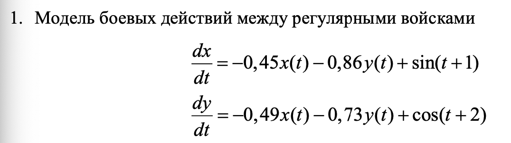
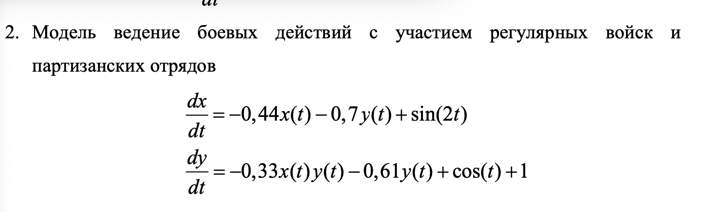
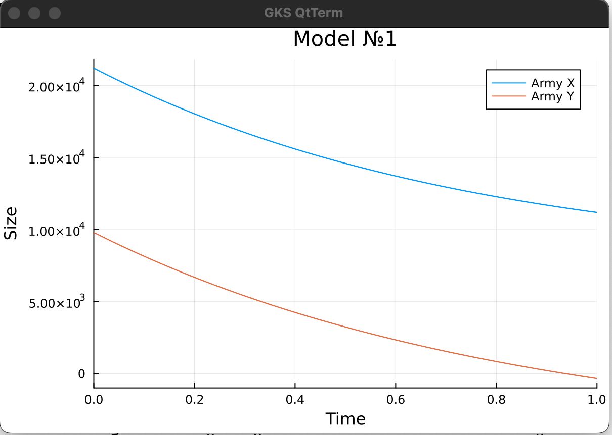
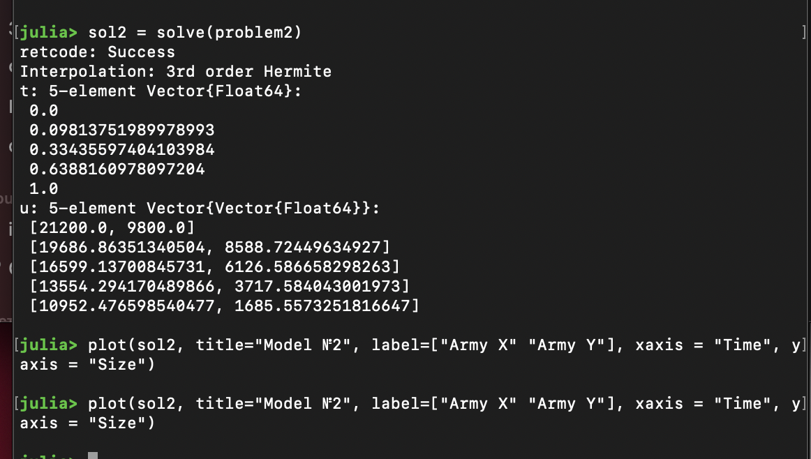
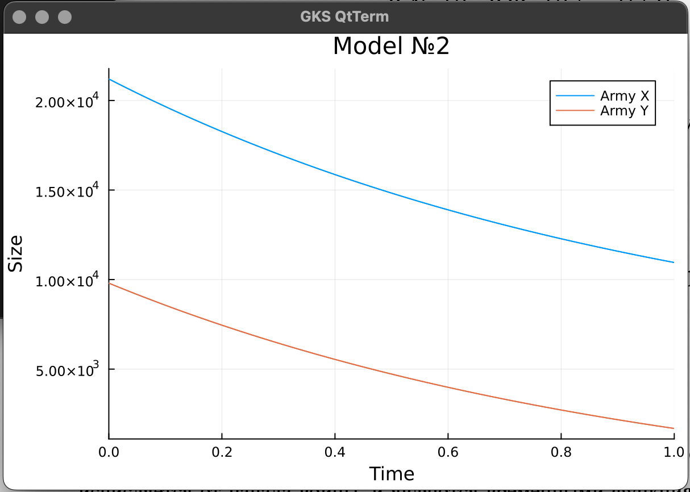

---
## Front matter
lang: ru-RU
title: Лабораторная работа №3
subtitle: Математическое моделирование
author:
  - Дикач А.О.
institute:
  - Российский университет дружбы народов, Москва, Россия
date: 20 марта 2025г

## i18n babel
babel-lang: russian
babel-otherlangs: english

## Formatting pdf
toc: false
toc-title: Содержание
slide_level: 2
aspectratio: 169
section-titles: true
theme: metropolis
header-includes:
 - \metroset{progressbar=frametitle,sectionpage=progressbar,numbering=fraction}
---

# Информация

## Докладчик

  * Дикач Анна Олеговна
  * НПИбд-01-22 (1132222009)
  * Российский университет дружбы народов
  * <https://github.com/chelibos?tab=repositories>

## Цель работы

Разобрать и построить модели "Боевые действия между регулярными войсками" и "Ведение боевых действий с участием регулярных войск и партизанских отрядов".

# Задача (10 вариант)

Между страной Х и страной У идет война. Численность состава войск
исчисляется от начала войны, и являются временными функциями x (t) и y (t). В
начальный момент времени страна Х имеет армию численностью 21 200 человек, а
в распоряжении страны У армия численностью в 9 800 человек. Для упрощения
модели считаем, что коэффициенты , , , a b c h постоянны. Также считаем P (t) и
Q (t) непрерывные функции.

## 

{#fig:007 width=60%}

{#fig:008 width=60%}

# Выполнение лабораторной работы

##  Начинаю построение графиков с создания функции sys_war_1, которая отвечает за модель боевых действий между регулярными войсками. Задаю параметры и формулы, а такде problem1

{#fig:001 width=60%}

##  Запускаю вычисление значений функции и прописываю строку для вывода графика

{#fig:002 width=60%}

## Просматриваю построеный график. В данном случае армия Y проигрывает в сражении, количество её войск быстрее стремиться к значению 0. Так как коэфциент эффективности боевых действий со стороны армии X больше коэффициента эффективности боевых действий со стороны армии Y 

{#fig:003 width=60%}

## Составляю функцию sys_war_2 для модели боевых действий с участием регулярных войск и партизанских отрядов

{#fig:004 width=60%}

## Задаю параметры и формулы, а такде problem2. Запускаю вычисление значений функции и прописываю строку для вывода графика

{#fig:005 width=60%}

##  Просматриваю построеный график. В данном случае армия Y проигрывает в сражении, количество её войск быстрее стремиться к значению 0. Так как коэфциент эффективности боевых действий со стороны армии X больше коэффициента эффективности боевых действий со стороны армии Y, а скорость пополнения войск слишком маленькая для того чтобы уровновесить силы и победить

{#fig:006 width=60%}

## Вывод

Разобрала модели, построила к ним графики и проанализировала полученный результат.

