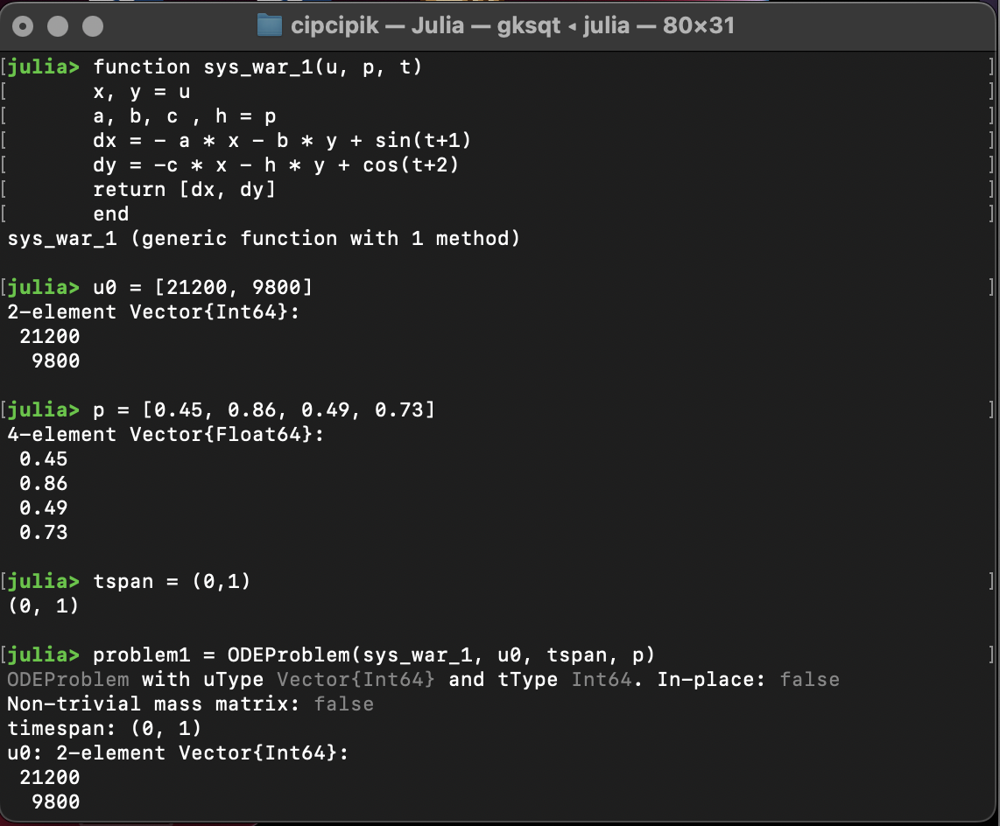
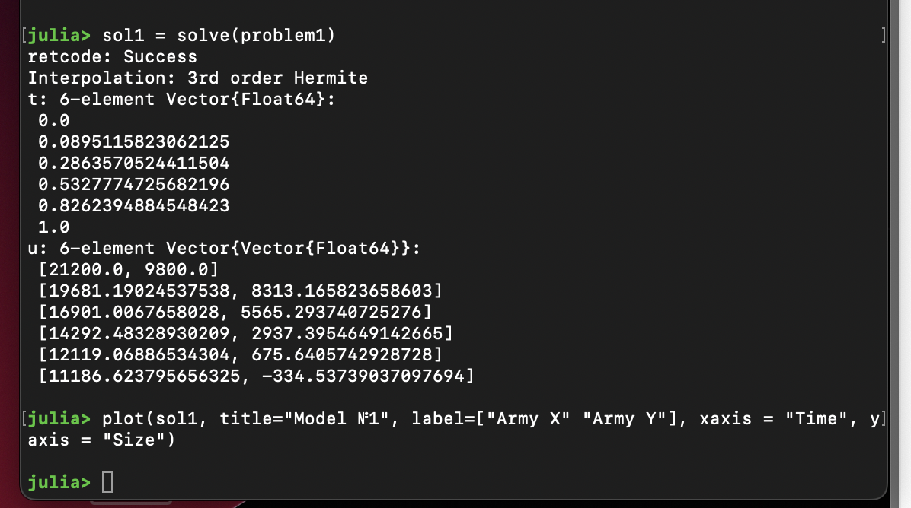
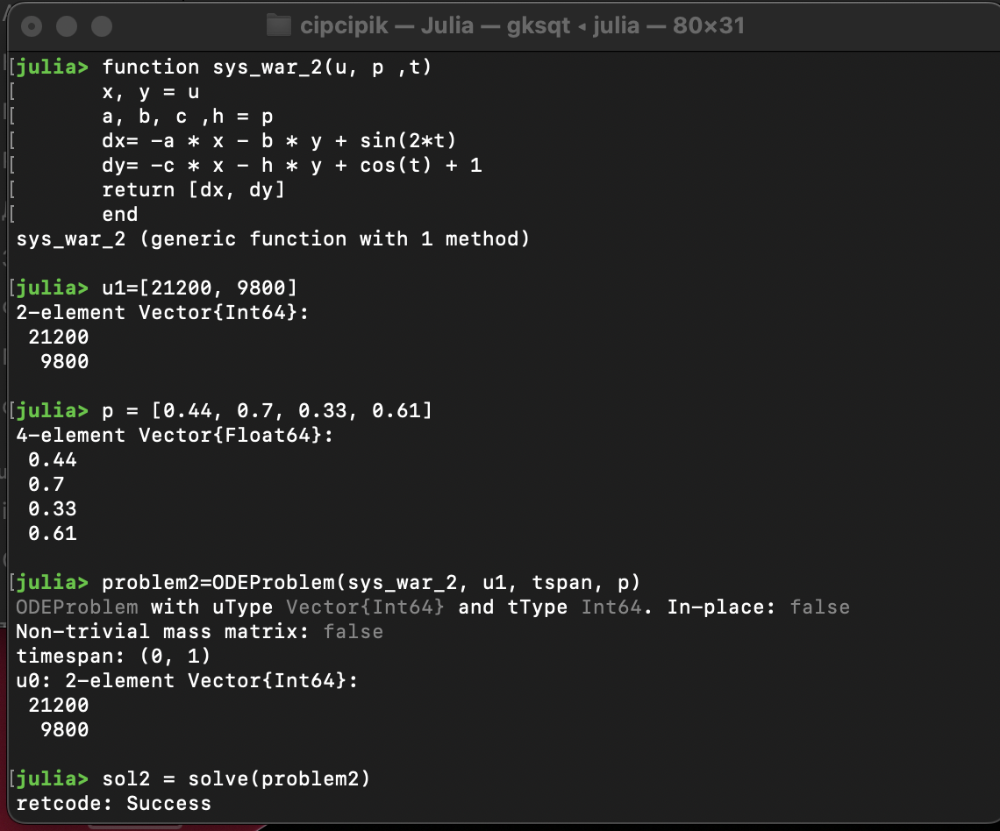

---
## Front matter
title: "Лабораторная работа №3"
subtitle: "Математическое моделирование"
author: "Дикач Анна Олеговна НПИбд-01-22"

## Generic otions
lang: ru-RU
toc-title: "Содержание"

## Bibliography
bibliography: bib/cite.bib
csl: pandoc/csl/gost-r-7-0-5-2008-numeric.csl

## Pdf output format
toc: true # Table of contents
toc-depth: 2
lof: true # List of figures
lot: true # List of tables
fontsize: 12pt
linestretch: 1.5
papersize: a4
documentclass: scrreprt
## I18n polyglossia
polyglossia-lang:
  name: russian
  options:
  - spelling=modern
  - babelshorthands=true
polyglossia-otherlangs:
  name: english
## I18n babel
babel-lang: russian
babel-otherlangs: english
## Fonts
mainfont: IBM Plex Serif
romanfont: IBM Plex Serif
sansfont: IBM Plex Sans
monofont: IBM Plex Mono
mathfont: STIX Two Math
mainfontoptions: Ligatures=Common,Ligatures=TeX,Scale=0.94
romanfontoptions: Ligatures=Common,Ligatures=TeX,Scale=0.94
sansfontoptions: Ligatures=Common,Ligatures=TeX,Scale=MatchLowercase,Scale=0.94
monofontoptions: Scale=MatchLowercase,Scale=0.94,FakeStretch=0.9
mathfontoptions:
## Biblatex
biblatex: true
biblio-style: "gost-numeric"
biblatexoptions:
  - parentracker=true
  - backend=biber
  - hyperref=auto
  - language=auto
  - autolang=other*
  - citestyle=gost-numeric
## Pandoc-crossref LaTeX customization
figureTitle: "Рис."
tableTitle: "Таблица"
listingTitle: "Листинг"
lofTitle: "Список иллюстраций"
lotTitle: "Список таблиц"
lolTitle: "Листинги"
## Misc options
indent: true
header-includes:
  - \usepackage{indentfirst}
  - \usepackage{float} # keep figures where there are in the text
  - \floatplacement{figure}{H} # keep figures where there are in the text
---

# Цель работы

Разобрать и построить модели "Боевые действия между регулярными войсками" и "Ведение боевых действий с участием регулярных войск и партизанских отрядов".

# Задача (10 вариант)

Между страной Х и страной У идет война. Численность состава войск
исчисляется от начала войны, и являются временными функциями x (t) и y (t). В
начальный момент времени страна Х имеет армию численностью 21 200 человек, а
в распоряжении страны У армия численностью в 9 800 человек. Для упрощения
модели считаем, что коэффициенты , , , a b c h постоянны. Также считаем P (t) и
Q (t) непрерывные функции  (рис. [-@fig:007])  (рис. [-@fig:008]).

{#fig:007 width=70%}

{#fig:008 width=70%}

# Выполнение лабораторной работы

1. Начинаю построение графиков с создания функции sys_war_1, которая отвечает за модель боевых действий между регулярными войсками. Задаю параметры и формулы, а такде problem1 (рис. [-@fig:001]).

{#fig:001 width=70%}

2. Запускаю вычисление значений функции и прописываю строку для вывода графика (рис. [-@fig:002]).

{#fig:002 width=70%}

3. Просматриваю построеный график. В данном случае армия Y проигрывает в сражении, количество её войск быстрее стремиться к значению 0. Так как коэфциент эффективности боевых действий со стороны армии X больше коэффициента эффективности боевых действий со стороны армии Y (рис. [-@fig:003]).

{#fig:003 width=70%}

4. Составляю функцию sys_war_2 для модели боевых действий с участием регулярных войск и партизанских отрядов (рис. [-@fig:004]).

{#fig:004 width=70%}

5. Задаю параметры и формулы, а такде problem2. Запускаю вычисление значений функции и прописываю строку для вывода графика (рис. [-@fig:005]).

{#fig:005 width=70%}

6. Просматриваю построеный график. В данном случае армия Y проигрывает в сражении, количество её войск быстрее стремиться к значению 0. Так как коэфциент эффективности боевых действий со стороны армии X больше коэффициента эффективности боевых действий со стороны армии Y, а скорость пополнения войск слишком маленькая для того чтобы уровновесить силы и победить (рис. [-@fig:006]).

{#fig:006 width=70%}

# Вывод

Разобрала модели, построила к ним графики и проанализировала полученный результат.

# Список литературы{.unnumbered}

::: {#refs}

:::

