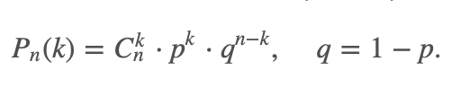
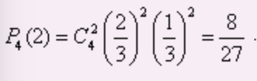
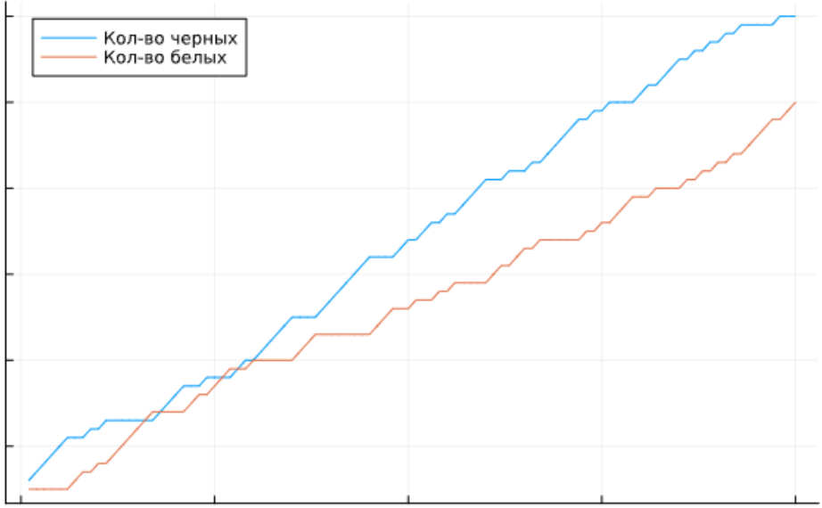
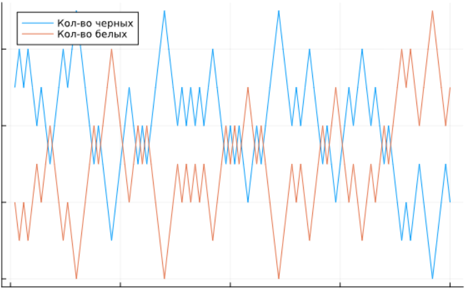

---
## Front matter
lang: ru-RU
title: Доклад на тему "Математические модели с урнами"
subtitle: Математическое моделирование
author:
  - Дикач А.О.
institute:
  - Российский университет дружбы народов, Москва, Россия
date: 

## i18n babel
babel-lang: russian
babel-otherlangs: english

## Formatting pdf
toc: false
toc-title: Содержание
slide_level: 2
aspectratio: 169
section-titles: true
theme: metropolis
header-includes:
 - \metroset{progressbar=frametitle,sectionpage=progressbar,numbering=fraction}
---

# Информация

## Докладчик

  * Дикач Анна Олеговна
  * НПИбд-01-22 (1132222009)
  * Российский университет дружбы народов
  * <https://github.com/chelibos?tab=repositories>

## Цель 

Исследовать математические модели с урнами. 

## Введение

Математические модели с урнами представляют собой важный и увлекательный раздел теории вероятностей, который изучает случайные процессы, связанные с выбором объектов из ограниченного набора. 

История моделей с урнами восходит к работам таких математиков, как Бенжамен Перре и Пьер-Симон Лаплас, которые исследовали вероятностные аспекты выбора и случайности. 

Модели с урнами находят применение в самых различных областях: от биологии и экологии до экономики и социологии. 

##  Описание общей модели 

Пусть дана урна с шарами двух цветов. На каждом шаге:

1. Из урны случайно извлекается один шар.
2. В зависимости от правил модели шар либо возвращается, либо заменяется.
3. Фиксируется цвет вынутого шара.

Математически это можно описать как марковский процесс, где состояние системы определяется текущим составом урны.

# Модель Бернулли

Модель Бернулли — это одна из самых простых и фундаментальных моделей в теории вероятностей, которая описывает случайный эксперимент с двумя возможными исходами. Она названа в честь швейцарского математика Якоба Бернулли, который внес значительный вклад в развитие теории вероятностей.

## Основные характеристики

**Исходы** 

Каждый исход имеет 2 возможных исхода. Обычно исходы обозначаются как **успех (1)** и **неудача (0)**

**Вероятности** 

Вероятность успеха обозначается как  p , а вероятность неудачи — как  q , где  q = 1 - p . Эти вероятности остаются постоянными для каждого испытания. 

**Независимость событий**

Каждое испытание является независимым, то есть результат одного испытания не влияет на результаты других.

## Применение модели

Модель Бернулли часто используется для описания различных явлений, таких как:

• Подбрасывание монеты (где успехом может быть "орел", а неудачей — "решка").

• Опросы, где респонденты могут ответить "да" или "нет".

• Проверка качества продукции, где изделия могут быть либо дефектными, либо бездефектными.

## Работа с моделью

Итак, пусть в результате испытания возможны два исхода: либо появится событие А, либо противоположное ему событие B. Проведем n испытаний Бернулли. Это означает, что все n испытаний независимы; вероятность появления события А в каждом отдельно взятом или единичном испытании постоянна и от испытания к испытанию не изменяется (т.е. испытания проводятся в одинаковых условиях). Обозначим вероятность появления события А в единичном испытании буквой р, т.е. p=P(A), а вероятность противоположного события (событие А не наступило) - буквой q=P(B)=1−p.

{#fig:001 width=50%}

## Пример

 В урне 20 белых и 10 черных шаров. Вынули 4 шара, причем каждый вынутый шар возвращают в урну перед извлечением следующего и шары в урне перемешивают. Найти вероятность того, что из четырех вынутых шаров окажется 2 белых.

1. Событие А - достали белый шар, событие В - достали чёрный шар
2. Вероятность события А равна 2/3, вероятность В равна 1/3

## 

3. По формуле Бернулли вероятность будет равна:

{#fig:004 width=70%}

## Модель Поля

В статистике модель урны Поля, названная в честь Джорджа Поля, представляет собой модель, в которой 
после того, как шар достается, он возвращается в урну, и ещё добавляется шар такого же цвета. Этот процесс повторяется.
Можно заметить, что если, например, белых шаров больше чем чёрных, то с большей вероятностью будет добавлен белый шар. 
То есть эта урна зависит от истории и сходится. 

## Особенность 

Даже если мы смоделируем ситуацию, где в урне находится одинаковое количество шаров белого и чёрного цвета, 
количество шаров одного цвета будет сильно больше шаров другого цвета. Допустим, вы начинаете с равным количеством шаров (7 белых, 7 красных). 

##

Если после первого испытания будет выбран белый шар, в урне окажется 8 белых и 7 чёрных шаров. В результате операции создаётся неравенство,  при котором в следующем испытании с большей вероятностью будет выбран белый шар, нежели черный. Шансы что будет выбран белый шар теперь составляют 8 к 15, а то что будет выбран чёрный 7 к 15. Такую ситуацию можно назвать снежным комом.

{#fig:002 width=40%}

## Модель баланса

Модель баланса, также известная как модель неудачной выборной кампании, была исследована Фридманом и может рассматриваться как симуляция предвыборной кампании, в которой кандидаты настолько некомпетентны, что избиратели решают голосовать за оппонента. В отличие от модели Поля, эта урна нацелена на поддержание равновесия между черными и белыми шарами. В данной модели, после извлечения шара, в урну помещается шар противоположного цвета. Эта модель стремится к состоянию равновесия.

## Основная постановка задачи

Имеется n шаров и k урн. Шары размещаются в нескольких вариациях:

- Различные шары в различные урны
- Неразличимые шары в различимые урны
- Различимые шары в неразличимые урны
- Неразличимые шары в неразличимые урны

## Пример 

5 шаров случайно бросают в 3 урны. Какова вероятность, что хотя бы одна урна останется пустой?

1. всего способов распределить шары 3^5 = 243
2. Число способов, где шары попадают только в 2 урны: (3/1) * 2^5 = 96
3. Из полученного числа необходимо вычесть случаи, когда ввсе шары в одной урне: 96 - 3 = 93

##

4. Для получения вероятности делим 93 на 243. Получаем что вероятность равна 0.383

{#fig:003 width=70%}

## Заключение

Урновые модели — мощный инструмент математического моделирования, применяемый в теории вероятностей, статистической физике, компьютерных науках, экономике и социологии. Разные модификации позволяют описывать сложные системы с вероятностными взаимодействиями.

